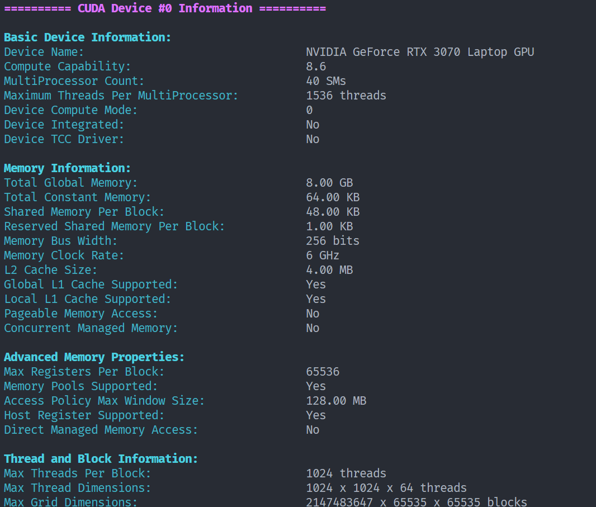

# CUDA Device Information Utility

This utility provides a comprehensive and detailed analysis of CUDA-capable devices in your system. It offers an in-depth look at the hardware properties and capabilities of each CUDA device, presented in a user-friendly, color-coded format.

## Key Features

- **Multi-Device Support**: Automatically detects and displays information for all CUDA devices in the system.
- **Color-Coded Output**: Enhances readability with a visually appealing, color-coded display.
- **Comprehensive Device Analysis**: Covers a wide spectrum of device properties, including:
  - Core device specifications
  - Memory architecture and capabilities
  - Thread and block characteristics
  - Texture and surface memory details
  - Advanced hardware features
  - Kernel execution properties
  - PCI bus information
  - Performance metrics

## System Requirements

- CUDA-capable GPU
- CUDA Toolkit (version 11.0 or later recommended for full feature support)
- C++11 compatible compiler

## Quick Start Guide

### Compilation (if you don't want to install ~~nvidia-cuda-toolkit~~`(it's really large!7GB!)`,you can run the executable file directly)

Compile the program using the following command:

```bash
nvcc -std=c++11 cuda_device_info.cu -o cuda_device_info
```

### Execution

Run the compiled executable:

```bash
./cuda_device_info
```

The utility will automatically scan for CUDA devices and display their information.

## Detailed Output

The utility generates a comprehensive report for each CUDA device, organized into the following sections:

1. Basic Device Information
2. Memory Architecture
3. Advanced Memory Properties
4. Thread and Block Specifications
5. Clock Frequencies
6. Texture Memory Capabilities
7. Surface Memory Features
8. Advanced Hardware Features
9. Kernel Execution Properties
10. Hardware-Specific Features
11. PCI Bus Information
12. Persisting L2 Cache Properties (CUDA 11.0+)
13. Performance Metrics and Bandwidth Calculations

### Sample Output



## Compatibility Note

Some advanced properties may not be available on older CUDA versions or hardware. The program employs conditional compilation to ensure compatibility across different CUDA versions.

## More Information

For more information on CUDA programming and GPU computing, visit [NVIDIA's CUDA Zone](https://developer.nvidia.com/cuda-zone).
